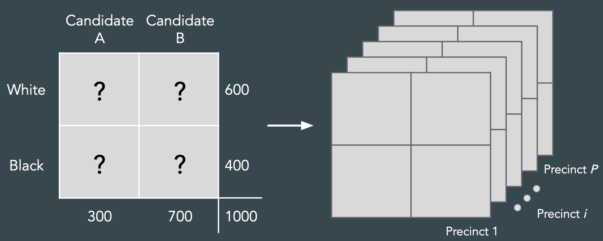
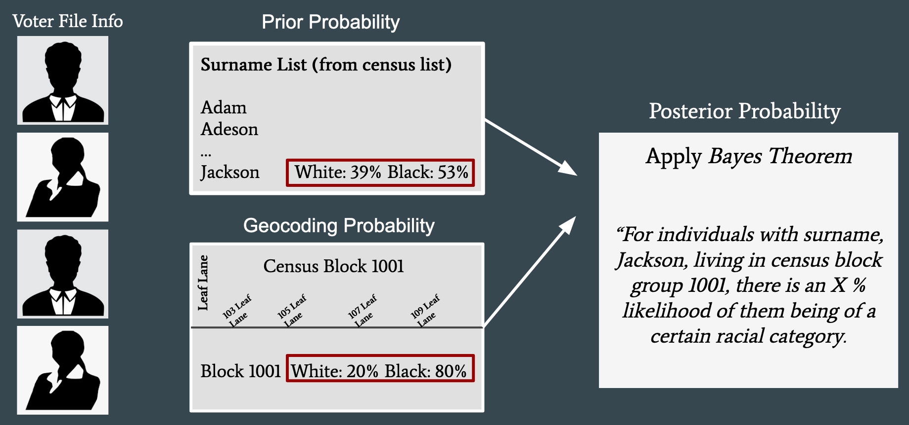

The pipeline for detecting vote dilution, highlighted in the
[Methods](methods.md) page, requires the application of several analysis
techniques such as ecological inference (EI), Bayesian Improved Surname
Geocoding (BISG), and a performance analysis. In this section, we detail these
analyses, their components, and limitations. Each of these analyses are
incorporated into eiCompare to facilitate detection of vote dilution across a
broad array of datasets.

## Ecological Inference

As stated in the Motivation page, voting rights litigation relies on the Gingles
Test, which requires the following conditions to be satisfied for a Voting
Rights Act violation:

1. The group of minority voters is sufficiently large and geographically
   compact.
2. Minority voters are politically cohesive in supporting their candidate of
   choice
3. The majority votes in a bloc to usually defeat the minority’s preferred
   candidate.

The datasets we have access to, as described in Methods, provide us information
about who voted (from the voter file) and which candidates received votes (from
the election results). Knowing these totals isn’t good enough to meet the
requirements of the Gingles test - we actually need to know which candidates 
voters supported in order to determine whether majority voters and minority 
voters were cohesive blocks supporting different candidates (criteria 2 and 3). 
By law, the specific candidates chosen by a voter are secret to ensure the 
voter’s privacy. Thus, we need to infer these quantities from the data.

At first glance, this may seem impossible. For example, consider a toy election
with white and Black voters choosing between Candidates A and B (Figure 1,
left). We might know the marginal data – the totals for each row and column, as
shown – but we don’t know the individual entries in the table (Figure 1:
question marks). The voters could be split into any number of assortments across
the four individual blocks that satisfy the requirement of adding up to the
marginals. How do we choose the most reasonable vote allocation?

<b>Figure 2:</b> The ecological inference problem.

A closer inspection reveals we have more information that we can tap into.
Election data typically consists of voter turnout and results across precincts,
which are smaller geographic units in the electoral district. Thus, instead of
having one table with known marginals, we actually have many tables (one for
each precinct: see Figure 1, right). If we reasonably assume that racial groups
don’t vote too differently across precincts, we can leverage the statistical
regularities in voting patterns across the tables to infer what fraction of
voters support different candidates, across racial groups. This is the
ecological inference (EI) problem: using patterns in ecological units (in this
case, precincts) to infer individual-level (voters) behavior.

There are a variety of approaches to solve the ecological inference problem.
These approaches generally assume an underlying statistical model describing
voting patterns that can be fit to the data. Currently, two approaches are
predominantly used in voting rights litigation: King's iterative EI (King et
al., 1997) and rows by columns (RxC) method (Rosen et al., 2001). Both
approaches have their pros and cons. The `eiCompare` package helps facilitate
comparisons between these approaches.

See the [EI vignette](ei.md) for details on how to use `eiCompare` to apply EI to voter
data.

## Bayesian Improved Surname Geocoding

To proceed with ecological inference, we need accurate counts of the turnout by
racial group (Figure 5: row marginals). Ultimately, this requires knowledge of
each voter’s race, which is not always provided on the voter file. In the cases
where we don’t have access to each voter’s race, we need to estimate it from the
data. We use an approach called Bayesian Improved Surname Geocoding (BISG) to
obtain probabilistic estimates of each voter’s race in a voter file, which can
then be used to estimate turnout by race across precinct.

<b>Figure 2:</b> BISG leverages surnames
and location to obtain a probabilistic estimate of race.

BISG relies on the observation that both a person’s surname and location are
informative about their race (Elliott et al., 2009). It crucially relies on the
Census Bureau’s comprehensive database of surnames and tabulation of racial
groups in geographic blocks across the United States. To apply BISG, we first
assume that a person’s surname provides prior knowledge of what their race might
be (e.g., a person with a surname of “Jackson” has a 53% chance of being black:
Figure 2). Next, we use that voter’s location to “update” the probability to a
posterior probability of race using Bayes’ Theorem. For example, if the person
with the surname “Jackson” lives in an area that is predominantly black, that
greatly increases the probability that they are black.

In practice, we utilize the package WRU (“Who Are You”) provided by Imai and
Khanna (2016) to calculate the BISG. This package also allows updating the
posterior probability using knowledge of a voter’s sex, age, and party
affiliation, though in practice these latter features may have limited impact on
the posterior probabilities.

See the [BISG vignette](bisg.md) for more details.

## Performance Analyses

The ultimate outcome from voting rights litigation is to throw out a districting
map that does not allow adequate representation for minority groups, prompting
the need for a new districting map. Thus, we need to assess whether the new
districting map provides sufficient representation for minority groups. To do
so, we can look at past elections, and observe how candidates would perform
if the proposed map was used at the time (how it would "perform") of the
election. This is the basis of a performance analysis.

Importantly, a performance analysis should be performed with the voter turnout
data rather than the registered voter data or tabulations of eligible voters.
The voter turnout data reflects who actually voted in the election, rather than
who might have voted.

See the [performance analysis vignette](performance_analysis.md) for more
details on how to use `eiCompare` to run a performance analysis.

## References

1. Elliott, M. N., Morrison, P. A., Fremont, A., McCaffrey, D. F., Pantoja, P., & Lurie, N. (2009). Using the Census Bureau’s surname list to improve estimates of race/ethnicity and associated disparities. Health Services and Outcomes Research Methodology, 9(2), 69.

2. King, G. (1997). A solution to the ecological inference problem: reconstructing individual behavior from aggregate data. Princeton: Princeton University Press.

3. Imai, K., & Khanna, K. (2016). Improving ecological inference by predicting individual ethnicity from voter registration records. Political Analysis, 263-272.

4. Rosen, O., Jiang, W., King, G., Tanner, M.A. (2001). Bayesian and frequentist inference for ecological inference: the R x C case. Statistica Neerlandica, 55, 2, p. 134-156. 
